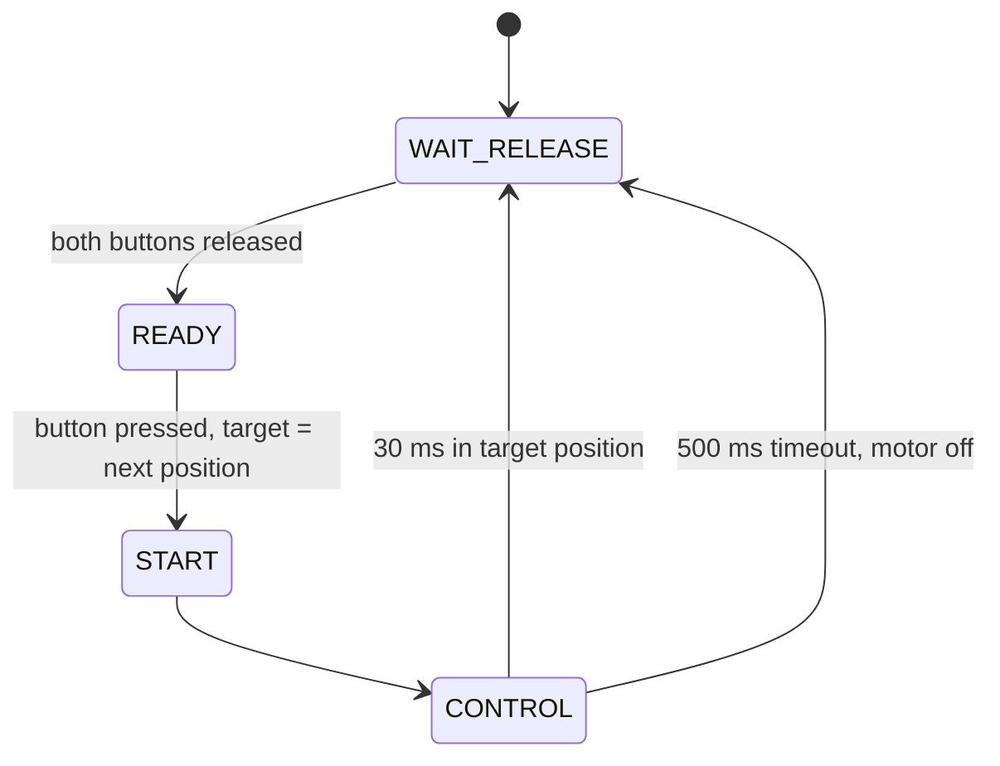

# Automated Motorcycle Gearbox

[](https://doi.org/10.5281/zenodo.23002656) [](https://github.com/josto-me/automated-motorcycle-gearbox/actions/workflows/build.yml) [](LICENSE) [](LICENSE-CC-BY-4.0.txt) [](CITATION.cff)

Automatisiertes Schaltgetriebe für Motorräder, Diplomarbeit an der WHZ Zwickau.

Electromechanical shift drum actuator for a sequential motorcycle gearbox: a DC motor turns the
shift drum directly, a potentiometer on the drum measures its position, and two buttons request
an upshift or a downshift. The repository contains

- the firmware for a SAMD21 microcontroller that moves the drum to the next gear position with a
  proportional position controller, and
- a dataset of 84 measured manual shift times of a series-production motorcycle, the reference
  for the shift time the actuator has to reach.

## Safety and disclaimer

This is a research prototype, not a certified product. A gearbox actuator that shifts at the
wrong moment, gets stuck between two gears or loses power while riding can cause a crash.
The firmware has only been run on a test gearbox; it contains no vehicle safety functions (no
plausibility checks against vehicle speed or engine speed, no fault handling for a broken
potentiometer). Do not use it on a vehicle on public roads. No warranty, see the licenses.

## Firmware

`firmware/Shift_Actuator/` runs on an ATSAMD21G18A at 48 MHz (DFLL48M locked to a 32.768 kHz
crystal). Register level C, no Arduino core.

### How it works

- Every 50 µs (TC3 tick) the main loop debounces both buttons and runs the shift sequence.
- The ADC converts the drum potentiometer continuously (free running, internal 1.0 V reference).
- `Get_Drum_Pos()` turns the ADC value into a position code: 20 = 1st, 30 = neutral,
  40 = 2nd … 80 = 6th, odd tens (15, 25 … 85) = between two positions. A gear counts as engaged
  within ±57 digits (about ±5° drum angle) of its calibrated value.
- A button press sets the next position as target (order 1 – N – 2 – 3 – 4 – 5 – 6). A
  proportional controller drives the motor until the drum stays in the target position for
  30 ms. If a shift does not finish within 500 ms, the motor is switched off.
- The motor is driven by two half bridges (one per motor terminal) with 32 kHz PWM from TCC2.
  In the idle state both high side switches are closed, so there is no voltage at the motor.



### Pins

| Pin | Function |
|---|---|
| PA16 (TCC2 WO[0]) | PWM half bridge, motor terminal − |
| PA17 (TCC2 WO[1]) | PWM half bridge, motor terminal + |
| PA20 | upshift button to GND, external pull-up |
| PA21 | downshift button to GND, external pull-up |
| PB08 (AIN[2]) | shift drum potentiometer, 0 … 1 V |

### Calibration

`GEAR_POS_VAL` in `global.c` contains **placeholders**. Measure the ADC value of every gear
position on your gearbox (1st, N, 2nd … 6th, ascending) and enter it there. The ADC value is
inverted in the interrupt so that it rises on upshift; if your potentiometer turns the other
way, remove the inversion in `ADC_Handler()`. The gain `KP` and the timing values in `apps.c` are
starting points and have to be tuned on the gearbox.

### Build

Needs `arm-none-eabi-gcc` with newlib and two header packages that are not part of this
repository:

- CMSIS device headers, startup file and linker script for the SAMD21:
  `CMSIS-Atmel/CMSIS/Device/ATMEL` from <https://github.com/arduino/ArduinoModule-CMSIS-Atmel>
- CMSIS core headers: `CMSIS/Core/Include` from <https://github.com/ARM-software/CMSIS_5>

```
make -C firmware/Shift_Actuator CMSIS_ATMEL=<path> CMSIS_CORE=<path>
```

The result is `Shift_Actuator.hex` for a SWD programmer. The CI builds the firmware and runs a
host test of the position conversion (`test/`) on every push.

## Dataset: manual gear shift times

84 measured shift times of manual gear changes (42 upshifts, 42 downshifts) on a
large-displacement series-production motorcycle on a chassis dynamometer.

### Method

- Motorcycle: large-displacement series-production motorcycle with a conventional sequential gearbox, all rider assistance systems disabled
- Signal: voltage of the series shift drum position sensor (potentiometer), recorded with an oscilloscope without cutting the signal line to the engine control unit
- Shift time: duration of the change of the sensor signal from one gear position to the next
- Riding conditions mixed on purpose: acceleration at low and high engine speed, downshifts while braking hard, relaxed and sporty riding, with and without clutch, pulling away under high load
- One rider, test bench, no road conditions

### File

[`data/shift-times.csv`](data/shift-times.csv)

| Column | Unit | Description |
|---|---|---|
| `id` | – | U01…U42 upshifts, D01…D42 downshifts, in the order of the table in Appendix 4 of the thesis |
| `direction` | – | `up` or `down` |
| `shift_time_ms` | ms | measured shift time, resolution 1 ms |

Upshifts and downshifts are independent samples, not pairs.

### Summary

| | n | Mean | SD | 95 % CI of mean | Median | Min | Max | ≤ 100 ms |
|---|---|---|---|---|---|---|---|---|
| Upshift | 42 | 80.1 ms | 47.9 ms | ± 14.5 ms | 71.5 ms | 26 ms | 300 ms | 83 % |
| Downshift | 42 | 92.4 ms | 57.4 ms | ± 17.4 ms | 80.0 ms | 21 ms | 257 ms | 69 % |

CI with normal approximation (1.96 · SD / √n).

## Thesis

Stockhammer, J.: *Entwickeln eines automatisierten Schaltgetriebes für Motorräder –
Elektromechanischer Direktantrieb der Schaltwalze über ein selbsthemmendes
Schneckengetriebe*. Diplomarbeit, Westsächsische Hochschule Zwickau, 2019 (Chapter 3.5, Appendix 4).

## License

- Code in `firmware/` and `test/`: **Apache License 2.0**, see [`LICENSE`](LICENSE) and [`NOTICE`](NOTICE).
- Data in `data/` and the documentation: **CC BY 4.0**, see [`LICENSE-CC-BY-4.0.txt`](LICENSE-CC-BY-4.0.txt).

You may use, change and share everything, also commercially. When you pass it on or publish
something based on it, credit it as:

> Johannes Stockhammer, "Automated Motorcycle Gearbox", version 1.0.0, Zenodo, https://doi.org/10.5281/zenodo.23002656

GitHub shows the same citation under "Cite this repository" (from [`CITATION.cff`](CITATION.cff)).

## Dependencies

Not part of this repository; their licenses apply to them and to binaries built with them:

| Component | License |
|---|---|
| CMSIS-Atmel device headers, startup file, linker script (Microchip/Atmel, via Arduino) | Atmel BSD-style license (use with Atmel/Microchip devices) |
| Arm CMSIS core headers | Apache-2.0 |
| newlib (C library of the toolchain) | BSD-style licenses |

## Trademarks

Microchip, Atmel and SAM are trademarks of Microchip Technology Inc.; Arm and Cortex are
trademarks of Arm Limited. They are used only to identify the hardware, with no affiliation or
endorsement.

## Author

Johannes Stockhammer

Concept, hardware, measurements and original firmware by Johannes Stockhammer. The firmware was revised and the translation and documentation were refined with the help of AI tools and reviewed by the author.
